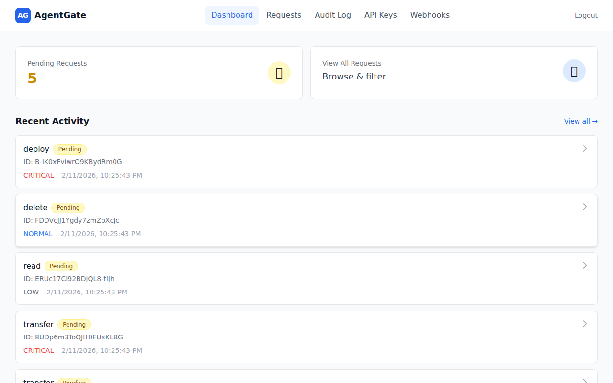
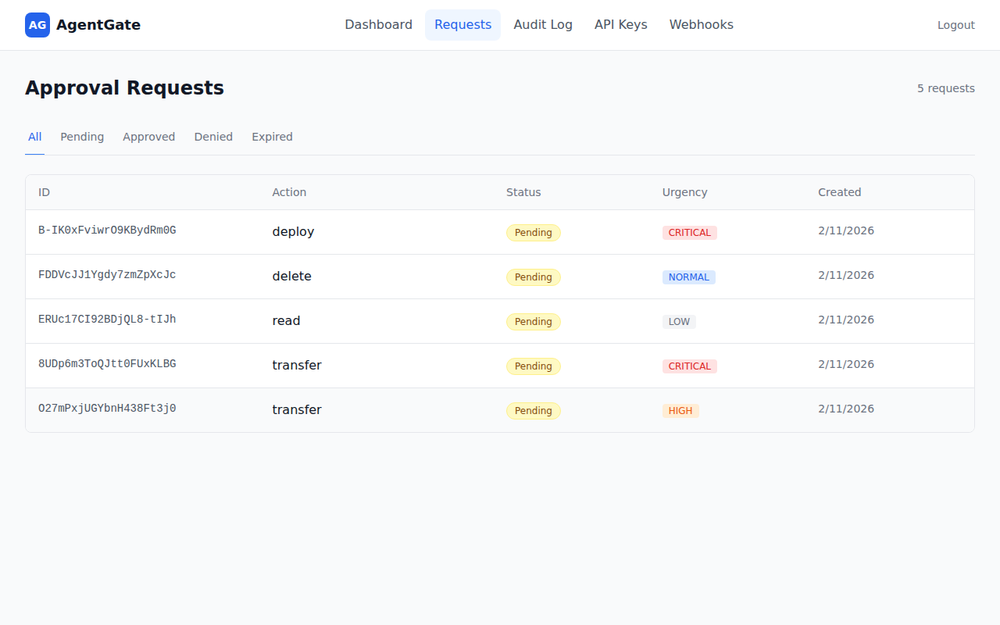
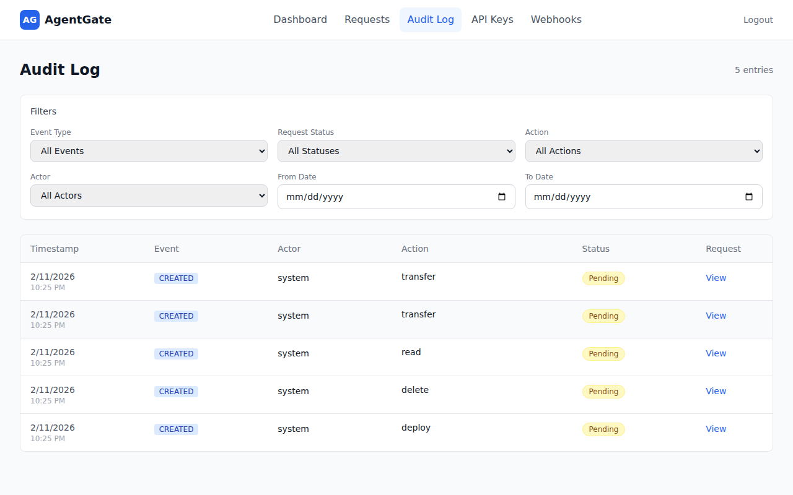
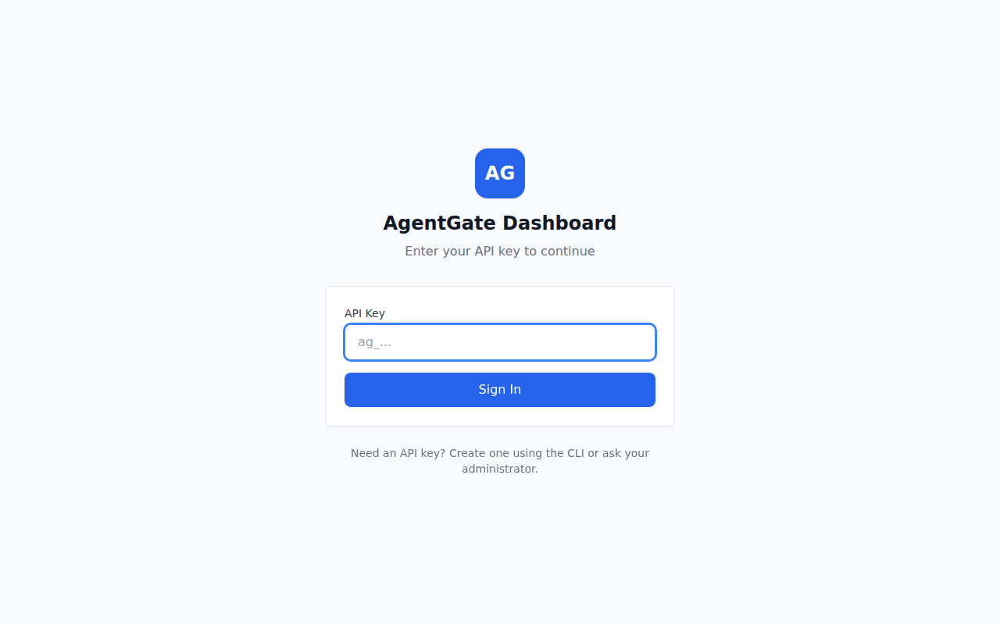

<p align="center">
  <h1 align="center">AgentGate</h1>
  <p align="center">
    <strong>Human-in-the-loop approval system for AI agents.</strong><br>
    Agents request. Policies decide. Humans approve.<br>
    <em>Keep humans in control of what AI agents can do.</em>
  </p>
</p>

<p align="center">
  <a href="https://www.npmjs.com/search?q=%40agentgate"></a>
  <a href="./LICENSE"></a>
  <a href="#"></a>
  <a href="#"></a>
</p>

---

<p align="center">
  
</p>

Your AI agent wants to send an email, delete a file, or deploy to production.
**Should it?** AgentGate lets you define policies that auto-approve safe actions,
auto-deny dangerous ones, and route everything else to a human — via dashboard, Slack, Discord, or email.

### ✨ Highlights

- 🛡️ **Policy engine** — auto-approve, auto-deny, or route to humans based on rules
- 👥 **Multi-channel approvals** — Slack, Discord, email, or web dashboard
- 🔌 **TypeScript SDK + MCP** — works with any agent framework or Claude Desktop
- 🪝 **Webhooks with retry** — real-time notifications with exponential backoff
- 📝 **Full audit trail** — every request, decision, and action logged
- 🐳 **Docker-ready** — one `docker-compose up` for the full stack
- 🔐 **Production-hardened** — SSRF protection, ReDoS defense, structured logging, graceful shutdown
- 🔗 **One-click decision links** — approve or deny directly from notification emails and webhooks
- ♿ **Accessible UI** — keyboard-navigable approval modals, focus trapping, ARIA labels
- 💀 **Skeleton loading** — smooth loading states across every dashboard page
- ⚡ **Fast & lightweight** — Hono server, SQLite or PostgreSQL

#### Dashboard
See all pending requests at a glance, color-coded by urgency so you know what needs attention first.



#### Approval Requests
Review, approve, or deny requests — filter by status to focus on what matters.



#### Audit Log
Search through every decision with filters for event type, action, actor, and date range.



#### Request Detail
Drill into any request to see parameters, context, timeline, and audit trail — with one-click Approve/Deny buttons.


#### API Keys
Manage API keys with fine-grained scopes, rate limits, and usage tracking. Create, edit, or revoke keys from the dashboard.


#### Webhooks
Configure webhook endpoints for real-time notifications. Add URLs, pick events, and let AgentGate handle retries automatically.


#### Login
Sign in with your API key — create one via the CLI or ask your admin.



---

## Table of Contents

- [Quick Start](#quick-start)
- [Architecture](#architecture)
- [Packages](#packages)
- [SDK Usage](#sdk-usage)
- [CLI](#cli)
- [MCP Integration](#mcp-integration)
- [Authentication](#authentication)
- [API Endpoints](#api-endpoints)
- [Rate Limiting](#rate-limiting)
- [Webhooks](#webhooks)
- [Configuration](#configuration)
- [Docker Deployment](#docker-deployment)
- [Development](#development)
- [Troubleshooting](docs/troubleshooting.md)
- [Contributing](#contributing)
- [License](#license)

---

## Quick Start

### 1. Install dependencies

```bash
pnpm install
```

### 2. Run database migrations

```bash
pnpm --filter @agentgate/server db:migrate
```

### 3. Bootstrap (create admin API key)

```bash
pnpm --filter @agentgate/server bootstrap
```

**Save the API key** - it's shown once only! Set it in your environment:

```bash
export AGENTGATE_API_KEY="agk_..."
```

### 4. Start the development environment

```bash
# Start server (port 3000) and dashboard (port 5173)
pnpm dev
```

### 5. Run the demo

In a new terminal (with API key set):

```bash
export AGENTGATE_API_KEY="agk_..."
pnpm demo
```

### 6. Open the dashboard

Visit **http://localhost:5173** to view and manage approval requests.

## Architecture

```
┌─────────────────────────────────────────────────────────────────┐
│                         AI Agents                                │
│  (use @agentgate/sdk or MCP to request approvals)               │
└───────────────────────────┬─────────────────────────────────────┘
                            │ HTTP API (authenticated)
                            ▼
┌─────────────────────────────────────────────────────────────────┐
│                    AgentGate Server                              │
│  ┌──────────────┐  ┌──────────────┐  ┌──────────────┐          │
│  │ Policy Engine│  │ Request Store│  │ Audit Logger │          │
│  ├──────────────┤  ├──────────────┤  ├──────────────┤          │
│  │  API Keys    │  │  Webhooks    │  │  MCP Server  │          │
│  └──────────────┘  └──────────────┘  └──────────────┘          │
└───────────────────────────┬─────────────────────────────────────┘
                            │
              ┌─────────────┼─────────────┐
              ▼             ▼             ▼
┌────────────────┐ ┌────────────────┐ ┌────────────────┐
│  Web Dashboard │ │   Slack Bot    │ │  Discord Bot   │
│(React+Tailwind)│ │(approve in DM) │ │(approve in ch) │
└────────────────┘ └────────────────┘ └────────────────┘
              │             │             │
              └─────────────┼─────────────┘
                            ▼
                      ┌──────────┐
                      │  Humans  │
                      └──────────┘
```

## Packages

| Package | Description | Docs |
|---------|-------------|------|
| [`@agentgate/core`](./packages/core) | Types, schemas, policy engine | - |
| [`@agentgate/server`](./packages/server) | Hono API server | - |
| [`@agentgate/sdk`](./packages/sdk) | TypeScript SDK for agents | [README](./packages/sdk/README.md) |
| [`@agentgate/cli`](./packages/cli) | Command-line interface | - |
| [`@agentgate/mcp`](./packages/mcp) | MCP server for Claude Desktop | - |
| [`@agentgate/slack`](./packages/slack) | Slack bot integration | [README](./packages/slack/README.md) |
| [`@agentgate/discord`](./packages/discord) | Discord bot integration | [README](./packages/discord/README.md) |
| [`@agentgate/dashboard`](./packages/dashboard) | React web dashboard | - |

## SDK Usage

```typescript
import { AgentGateClient } from '@agentgate/sdk';

// Create client with API key
const client = new AgentGateClient({
  baseUrl: 'http://localhost:3000',
  apiKey: process.env.AGENTGATE_API_KEY,
});

// Request approval
const request = await client.request({
  action: 'send_email',
  params: {
    to: 'customer@example.com',
    subject: 'Order shipped!',
  },
  urgency: 'normal',
});

// Wait for human decision
const decided = await client.waitForDecision(request.id, {
  timeout: 60000, // 1 minute
});

if (decided.status === 'approved') {
  // Execute the action
  await sendEmail(decided.params);
} else {
  console.log('Action denied:', decided.decisionReason);
}
```

## CLI

AgentGate includes a command-line interface for managing approval requests.

### Installation

```bash
# From the monorepo
pnpm --filter @agentgate/cli build

# Or install globally (when published)
npm install -g @agentgate/cli
```

### Configuration

Configure the CLI with your server URL and API key:

```bash
# Set server URL
agentgate config set serverUrl http://localhost:3000

# Set API key
agentgate config set apiKey agk_your_api_key

# View current config
agentgate config show
```

Configuration is stored in `~/.agentgate/config.json`. You can also use environment variables:

```bash
export AGENTGATE_URL=http://localhost:3000
export AGENTGATE_API_KEY=agk_...
```

### Commands

| Command | Description |
|---------|-------------|
| `agentgate config show` | Show current configuration |
| `agentgate config set <key> <value>` | Set a configuration value |
| `agentgate request <action>` | Create a new approval request |
| `agentgate status <id>` | Get status of a request |
| `agentgate list` | List approval requests |
| `agentgate approve <id>` | Approve a pending request |
| `agentgate deny <id>` | Deny a pending request |

### Examples

```bash
# Create a request
agentgate request send_email \
  --params '{"to": "user@example.com", "subject": "Hello"}' \
  --urgency high

# List pending requests
agentgate list --status pending

# Approve a request
agentgate approve req_abc123 --reason "Looks good"

# Deny a request
agentgate deny req_abc123 --reason "Not authorized"

# Output as JSON
agentgate list --json
```

## MCP Integration

AgentGate includes a Model Context Protocol (MCP) server for integration with Claude Desktop and other MCP-compatible clients.

### Claude Desktop Configuration

Add to your `claude_desktop_config.json`:

```json
{
  "mcpServers": {
    "agentgate": {
      "command": "npx",
      "args": ["@agentgate/mcp"],
      "env": {
        "AGENTGATE_URL": "http://localhost:3000",
        "AGENTGATE_API_KEY": "agk_..."
      }
    }
  }
}
```

### Available MCP Tools

| Tool | Description |
|------|-------------|
| `agentgate_request_approval` | Create a new approval request |
| `agentgate_check_request` | Get status of an approval request |
| `agentgate_list_requests` | List pending approval requests |
| `agentgate_list_policies` | List configured policies |
| `agentgate_create_policy` | Create a new policy rule |
| `agentgate_update_policy` | Update an existing policy |
| `agentgate_delete_policy` | Delete a policy |

## Authentication

AgentGate uses API keys for authentication. All API requests (except `/health`) require a valid API key.

### API Key Scopes

| Scope | Description |
|-------|-------------|
| `admin` | Full access to all operations |
| `request:create` | Create new approval requests |
| `request:read` | Read approval requests |
| `request:decide` | Approve or deny requests |
| `webhook:manage` | Create/update/delete webhooks |

### Using API Keys

**HTTP Header:**
```bash
curl -H "Authorization: Bearer agk_..." http://localhost:3000/api/requests
```

**SDK:**
```typescript
const client = new AgentGateClient({
  baseUrl: 'http://localhost:3000',
  apiKey: process.env.AGENTGATE_API_KEY,
});
```

### Creating Additional API Keys

```typescript
// Via API (requires admin scope)
POST /api/keys
{
  "name": "My Agent",
  "scopes": ["request:create", "request:read"]
}
```

## API Endpoints

| Method | Endpoint | Description | Required Scope |
|--------|----------|-------------|----------------|
| `POST` | `/api/requests` | Create approval request | `request:create` |
| `GET` | `/api/requests` | List requests (with filters) | `request:read` |
| `GET` | `/api/requests/:id` | Get request by ID | `request:read` |
| `POST` | `/api/requests/:id/decide` | Submit approval/denial | `request:decide` |
| `GET` | `/api/requests/:id/audit` | Get audit trail | `request:read` |
| `GET` | `/api/policies` | List policies | `admin` |
| `POST` | `/api/policies` | Create policy | `admin` |
| `PUT` | `/api/policies/:id` | Update policy | `admin` |
| `DELETE` | `/api/policies/:id` | Delete policy | `admin` |
| `GET` | `/api/webhooks` | List webhooks | `webhook:manage` |
| `POST` | `/api/webhooks` | Create webhook | `webhook:manage` |
| `DELETE` | `/api/webhooks/:id` | Delete webhook | `webhook:manage` |
| `GET` | `/health` | Health check | (none) |

## Rate Limiting

AgentGate supports per-API-key rate limiting to prevent abuse and ensure fair usage.

### How It Works

- Rate limits use a **sliding window algorithm** (requests per minute)
- Limits are configured per API key
- When exceeded, requests return `429 Too Many Requests`
- Rate limit headers are included in all authenticated responses

### Rate Limit Headers

| Header | Description |
|--------|-------------|
| `X-RateLimit-Limit` | Maximum requests per minute |
| `X-RateLimit-Remaining` | Remaining requests in current window |
| `X-RateLimit-Reset` | Seconds until window resets |

### Configuring Rate Limits

Set rate limits when creating or updating API keys:

```typescript
// Via API (requires admin scope)
POST /api/keys
{
  "name": "My Agent",
  "scopes": ["request:create", "request:read"],
  "rateLimit": 60  // 60 requests per minute
}

// null = unlimited
{
  "name": "Internal Service",
  "scopes": ["admin"],
  "rateLimit": null
}
```

### Dashboard

Rate limits can also be managed from the web dashboard under **Settings → API Keys**.

## Webhooks

AgentGate can notify external systems when request events occur.

### Setting Up Webhooks

```typescript
// Create a webhook via API
POST /api/webhooks
{
  "url": "https://your-server.com/webhook",
  "events": ["request.created", "request.decided"],
  "secret": "optional-signing-secret"
}
```

### Webhook Events

| Event | Description |
|-------|-------------|
| `request.created` | A new approval request was created |
| `request.decided` | A request was approved or denied |
| `request.expired` | A request expired without decision |

### Webhook Payload

```json
{
  "event": "request.decided",
  "timestamp": "2024-01-15T10:30:00Z",
  "data": {
    "id": "abc123",
    "action": "send_email",
    "status": "approved",
    "decidedBy": "admin@example.com"
  }
}
```

### Webhook Signatures

If you provide a `secret`, requests are signed with HMAC-SHA256:

```
X-AgentGate-Signature: sha256=...
```

Verify by computing `HMAC-SHA256(secret, body)` and comparing.

### Webhook Retry

Failed webhook deliveries are retried automatically with exponential backoff. The server scans for pending deliveries and retries them with increasing delays (`2^attempts * 1000ms`) until successful or the maximum retry count is reached.

## Configuration

### Environment Variables

| Variable | Default | Description |
|----------|---------|-------------|
| `PORT` | `3000` | Server port |
| `DATABASE_URL` | `./data/agentgate.db` | SQLite database path |
| `AGENTGATE_API_KEY` | - | API key for SDK/CLI |
| `SLACK_BOT_TOKEN` | - | Slack bot token (for Slack integration) |
| `SLACK_SIGNING_SECRET` | - | Slack signing secret |
| `DISCORD_BOT_TOKEN` | - | Discord bot token (for Discord integration) |
| `DISCORD_DEFAULT_CHANNEL` | - | Default Discord channel for notifications |

### File-Based Secrets (`_FILE` suffix)

For Docker secrets or Kubernetes secret mounts, AgentGate supports a `_FILE` suffix convention. Instead of setting a secret directly in an environment variable, point to a file containing the value:

| Variable | Reads secret from file |
|----------|----------------------|
| `ADMIN_API_KEY_FILE` | Sets `ADMIN_API_KEY` |
| `JWT_SECRET_FILE` | Sets `JWT_SECRET` |
| `DATABASE_URL_FILE` | Sets `DATABASE_URL` |
| `REDIS_URL_FILE` | Sets `REDIS_URL` |
| `SLACK_BOT_TOKEN_FILE` | Sets `SLACK_BOT_TOKEN` |
| `SLACK_SIGNING_SECRET_FILE` | Sets `SLACK_SIGNING_SECRET` |
| `DISCORD_BOT_TOKEN_FILE` | Sets `DISCORD_BOT_TOKEN` |
| `SMTP_PASS_FILE` | Sets `SMTP_PASS` |

**Behavior:**
- File contents are trimmed of leading/trailing whitespace
- If both the env var and the `_FILE` variant are set, the explicit env var takes precedence
- Missing or unreadable files produce a warning but do not crash the server

Example with Docker Compose:

```yaml
services:
  agentgate:
    environment:
      ADMIN_API_KEY_FILE: /run/secrets/admin_api_key
      JWT_SECRET_FILE: /run/secrets/jwt_secret
    secrets:
      - admin_api_key
      - jwt_secret

secrets:
  admin_api_key:
    file: ./secrets/admin_api_key.txt
  jwt_secret:
    file: ./secrets/jwt_secret.txt
```

### Policy Configuration

Policies are stored in the database and can be managed via API:

```typescript
// Example: Auto-approve low-risk emails
{
  name: "auto-approve-emails",
  priority: 10,
  enabled: true,
  rules: [
    {
      match: { action: "send_email" },
      decision: "auto_approve"
    }
  ]
}
```

## Docker Deployment

AgentGate provides Docker images for easy self-hosted deployments.

### Quick Start

1. **Copy the example environment file:**

```bash
cp .env.example .env
```

2. **Generate secure credentials:**

```bash
# Generate admin API key (required)
echo "ADMIN_API_KEY=$(openssl rand -hex 32)" >> .env

# Generate JWT secret (recommended for production)
echo "JWT_SECRET=$(openssl rand -hex 32)" >> .env
```

3. **Start all services:**

```bash
docker-compose up -d
```

4. **Access the services:**

- **Dashboard:** http://localhost:8080
- **API Server:** http://localhost:3000
- **Health Check:** http://localhost:3000/health

### Services

| Service | Description | Port |
|---------|-------------|------|
| `server` | AgentGate API server | 3000 |
| `dashboard` | Web dashboard (nginx) | 8080 |
| `postgres` | PostgreSQL database | internal only* |
| `redis` | Redis (rate limiting, queues) | internal only* |

> \* PostgreSQL and Redis are on an internal Docker network (`agentgate-internal`) and are **not exposed to the host** by default. During development, `docker-compose.override.yml` is auto-loaded and exposes them on ports 5432/6379. For production, run `docker-compose -f docker-compose.yml up -d` to skip the override.

### With Slack or Discord Bots

To include the bot services, use the `bots` profile:

```bash
# Set required bot credentials in .env first
docker-compose --profile bots up -d
```

### Configuration

All configuration is done via environment variables. See `.env.example` for all options.

**Required variables:**
- `ADMIN_API_KEY` — Admin API key (min 16 characters)

**Recommended for production:**
- `JWT_SECRET` — JWT signing secret (min 32 characters)
- `CORS_ORIGINS` — Restrict to your domain(s)
- `POSTGRES_PASSWORD` — Use a strong password

### Building Images

Build all images locally:

```bash
docker-compose build
```

Build a specific service:

```bash
docker-compose build server
docker-compose build dashboard
```

### Database Migrations

Migrations run automatically when the server starts. For manual control:

```bash
# Run migrations inside the container
docker-compose exec server node -e "
  import('./dist/db/migrate.js').then(m => m.runMigrations())
"
```

### Viewing Logs

```bash
# All services
docker-compose logs -f

# Specific service
docker-compose logs -f server

# Last 100 lines
docker-compose logs --tail=100 server
```

### Stopping Services

```bash
# Stop all
docker-compose down

# Stop and remove volumes (WARNING: deletes data)
docker-compose down -v
```

### Production Considerations

1. **Use a reverse proxy** (nginx, Caddy, Traefik) for TLS termination
2. **Set strong passwords** for PostgreSQL
3. **Restrict CORS origins** to your domain
4. **Use Docker secrets** for sensitive values in production
5. **Set up backups** for PostgreSQL data volume
6. **Monitor health endpoints** for uptime checks

## Development

```bash
# Install dependencies
pnpm install

# Run migrations
pnpm --filter @agentgate/server db:migrate

# Bootstrap (create admin key)
pnpm --filter @agentgate/server bootstrap

# Start development (server + dashboard)
pnpm dev
```

### Testing

AgentGate uses [Vitest](https://vitest.dev/) for testing across all packages.

```bash
# Run all tests
pnpm test

# Run tests with coverage report
pnpm test:coverage

# Run tests in watch mode (single package)
pnpm --filter @agentgate/server test:watch

# Run a specific test file
pnpm --filter @agentgate/server test -- src/__tests__/integration.test.ts
```

Coverage reports are generated per-package and include line, branch, and function coverage.

### Code Quality

```bash
# Build all packages
pnpm build

# Type checking
pnpm typecheck

# Lint (ESLint)
pnpm lint

# Fix lint issues
pnpm lint:fix

# Format code (Prettier)
pnpm format

# Check formatting
pnpm format:check
```

## Project Structure

```
agentgate/
├── packages/
│   ├── core/           # Shared types, schemas, policy engine
│   ├── server/         # Hono API server
│   ├── sdk/            # TypeScript SDK
│   ├── cli/            # Command-line interface
│   ├── mcp/            # MCP server for Claude Desktop
│   ├── slack/          # Slack bot
│   ├── discord/        # Discord bot
│   └── dashboard/      # React dashboard
├── apps/
│   └── demo/           # Demo application
├── docker-compose.yml  # Docker deployment
└── package.json        # Monorepo root
```

## 🔗 Part of the AgentKit Ecosystem

| Project | What it does | Link |
|---------|-------------|------|
| **AgentLens** | Observability & audit trail for AI agents | [github.com/amitpaz1/agentlens](https://github.com/amitpaz1/agentlens) |
| **AgentGate** | Human-in-the-loop approval gateway | **You are here** |
| **FormBridge** | Structured data collection for AI agents | [github.com/amitpaz1/formbridge](https://github.com/amitpaz1/formbridge) |
| **Lore** | Cross-agent memory and lesson sharing | [github.com/amitpaz1/lore](https://github.com/amitpaz1/lore) |
| **AgentEval** | Testing & evaluation framework for AI agents | [github.com/amitpaz1/agenteval](https://github.com/amitpaz1/agenteval) |

**Together:** Agents collect data (FormBridge) → request approval to act (AgentGate) → share lessons learned (Lore) → all observed and audited (AgentLens) → tested and evaluated (AgentEval).

## Contributing

Contributions are welcome! To get started:

1. Fork the repository
2. Clone and install dependencies (`pnpm install`)
3. Follow the [Development](#development) section above to set up your local environment
4. Create a feature branch and make your changes
5. Run `pnpm build && pnpm test` to verify everything works
6. Open a pull request

Please make sure all tests pass and code is formatted (`pnpm format:check && pnpm lint`) before submitting.

## License

MIT
